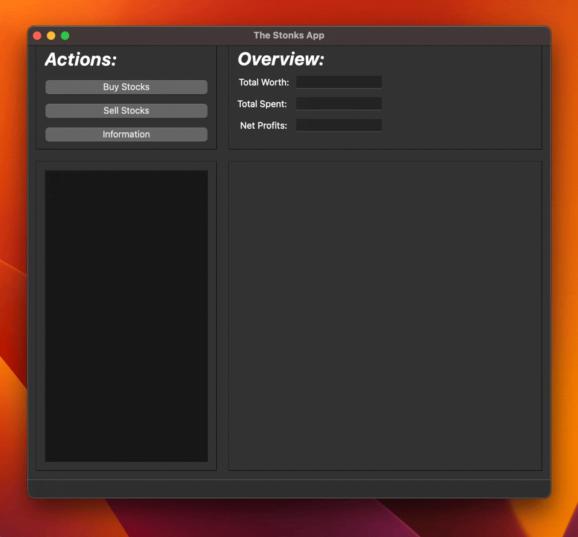

# Stock Tracking App

This QT application allows the user to keep track of their stock portfolio. Through many mathematical equations it is able to tell user's stock worth, total expenditures and net profits and, as a bonus, also shows a neat pie-chart of stocks based on how much they are worth.

## How to use:
- You may either load your portfolio off a .csv file or start inputting the information by hand.
- Click on a stock in the table and press "Information" to see more detailed info about it.
- Before closing the app make sure to save your portfolio by exporting it as a .csvc file.

